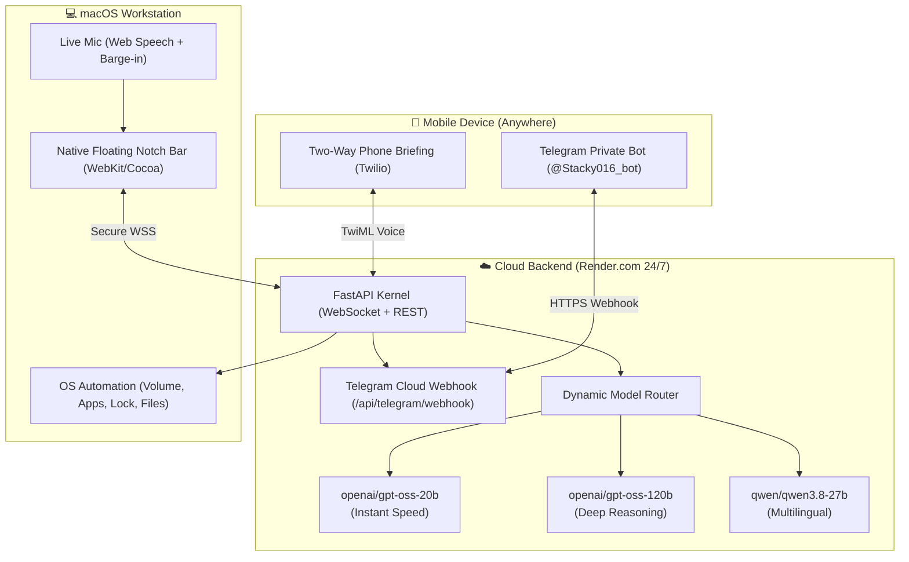

# Stacky-OS ⚡
### Autonomous Personal Operating System & Jarvis Assistant for macOS & Cloud

[](https://render.com)
[](https://groq.com)
[](https://apple.com)
[](https://fastapi.tiangolo.com)
[](https://telegram.org)

**Stacky-OS** is an autonomous, Jarvis-grade personal AI assistant engineered to seamlessly bridge your macOS workstation and mobile life. It features a native floating liquid-glass capsule anchored directly beneath your MacBook's hardware notch, an ultra-fast dynamic multi-model brain powered by Groq LPUs, and a 24/7 cloud backend on Render.com with zero battery or memory drain on your Mac.

---

## 🌟 Key Highlights

### 1. 🖥️ Native Apple Silicon Floating Notch HUD
- **Custom Native Cocoa/WebKit Window** (`bin/stacky_notch_bar`, 56KB native arm64 binary).
- 100% frameless, floating level, transparent liquid glass capsule anchored directly beneath your MacBook hardware display notch.
- **Dynamic 3D Volumetric Presence Orbs**:
  - `Listening`: Acoustic Light Waves
  - `Working / Thinking`: DNA Helix Braid
  - `Searching`: Quantum Hypercube (Rubik)
  - `Explaining`: Multi-Spectral Concentric Rings

### 2. 🧠 Groq Dynamic Multi-Model Brain (Mixture of Specialists)
Stacky automatically routes every command to the optimal model in real time:
- **Instant Speed Tier (<0.4s)**: `openai/gpt-oss-20b` for voice back-and-forth, system controls, and casual chat (14,400 free requests/day).
- **Frontier Reasoning Tier**: `openai/gpt-oss-120b` for complex code, architecture, research briefs, and multi-step logic (1,000 free requests/day).
- **Multilingual Specialist**: `qwen/qwen3.8-27b` for Hindi, Punjabi, and code translation.
- **Speech Perception**: `whisper-large-v3-turbo` for instant voice transcription.
- **Zero-Downtime Cascade**: Automatically cascades to backup models if a rate-limit is detected.

### 3. ☁️ 24/7 Cloud Backend on Render.com
- Built with **FastAPI** & **WebSockets**.
- Native **Telegram Webhook** (`/api/telegram/webhook`) handles incoming commands with **zero polling** and zero local CPU/battery consumption on your Mac.
- Deployable with a single click via `render.yaml`.

### 4. 📱 Mobile Companion (Telegram Private Bot)
- **On-Demand Work Sync**: Say *"Stacky, please save this file to the telegram"* to immediately push your active work files to your phone.
- **Remote Desktop Snapshot**: Fetch live screenshots of your Mac screen from college or on the go.
- **Remote File Fetching**: Search and download assignments, presentations, or documents from your Mac directly into Telegram.
- **Two-Way Voice Telephony**: Interactive voice calls powered by Twilio and neural British speech synthesis.

---

## 🏗️ Architecture



---

## 🚀 Quick Deployment to Render.com

### Step 1: Fork or Push to GitHub
```bash
git init
git add .
git commit -m "feat: Stacky-OS release"
git branch -M main
git remote add origin https://github.com/<YOUR_USERNAME>/stacky-os.git
git push -u origin main
```

### Step 2: Create Web Service on Render
1. Go to [Render Dashboard](https://dashboard.render.com) $\rightarrow$ **New Web Service**.
2. Select your `stacky-os` repository.
3. Render will auto-detect [`render.yaml`](render.yaml) or use:
   - **Build Command**: `pip install --upgrade pip && pip install -r requirements.txt`
   - **Start Command**: `uvicorn backend.app:app --host 0.0.0.0 --port $PORT`
4. Set Environment Variables:
   - `GROQ_API_KEY`: `gsk_...`
   - `TELEGRAM_BOT_TOKEN`: `8628400649:AAHOWPc...`
   - `TELEGRAM_ALLOWED_USER_ID`: `5714321696`
   - `STACKY_MODEL`: `openai/gpt-oss-120b`
   - `STACKY_DYNAMIC_ROUTING`: `true`

### Step 3: Activate Telegram Webhook
Once Render is live:
```bash
python3 deploy_to_telegram_webhook.py https://<YOUR-RENDER-APP>.onrender.com
```

---

## 💻 Running Locally (Optional Development Mode)

1. **Install Dependencies**:
```bash
python3 -m pip install -r requirements.txt
```

2. **Configure `.env`**:
```bash
cp .env.example .env
# Fill in your GROQ_API_KEY and TELEGRAM_BOT_TOKEN
```

3. **Start Stacky Backend**:
```bash
python3 run_stacky.py
```

4. **Launch Native macOS Floating Notch Bar**:
```bash
python3 launch_notch_window.py
```

---

## 🛡️ Security & Privacy
- **Strict User Lock**: Only the authenticated numeric Telegram ID can execute commands or receive files.
- **Zero Local Footprint**: No resident memory leaks, no heavy background daemons, and zero CPU usage when idle.
- **Git Hygiene**: `.env` and sensitive local files are strictly excluded via `.gitignore`.

---

## 📄 License
MIT License. Created with ❤️ for personal productivity and autonomous computing.
